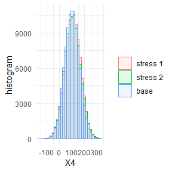

<!-- README.md is generated from README.Rmd. Please edit that file -->

# SWIM - A Package for Sensitivity Analysis

The SWIM package provides weights on simulated scenarios from a
stochastic model, such that stressed model components (random variables)
fulfil given probabilistic constraints (e.g. specified values for risk
measures), under the new scenario weights. Scenario weights are selected
by constrained minimisation of the relative entropy to the baseline
model.

## Installation

You can install the SWIM package from
[GitHub](https://github.com/spesenti/SWIM) with:

``` r
install.packages("spesenti/SWIM")
```

## Scope of the SWIM package

The SWIM package provides sensitivity analysis tools for stressing model
components (random variables). Implemented stresses are:

| R functions          | Stress                        |
| -------------------- | ----------------------------- |
| stress\_VaR          | VaR risk measure, a quantile  |
| stress\_VaR\_ES      | VaR and ES risk measures      |
| stress\_mean         | means                         |
| stress\_mean\_sd     | means and standard deviations |
| stress\_mean\_moment | moments, functions of moments |
| stress\_prob         | probabilities of intervals    |
| stress\_user         | user defined scenario weights |

Implemented functions allow to graphically display the change in the
probability distributions under different stresses and the baseline
model as well as calculating sensitivity measures.

## Example - Stressing the VaR of a portfolio

Consider a portfolio Y = X1 + X2 + X3 + X4 + X5, where (X1, X2, X3, X4,
X5) are correlated normally distributed with equal mean and different
standard deviations. We stress the VaR (quantile) of the portfolio loss
Y at levels 0.75 and 0.9 with an increase of 10%.

``` r
set.seed(0)
SD <- c(70, 45, 50, 60, 75)
Corr <- matrix(rep(0.5, 5^2), nrow = 5) + diag(rep(1 - 0.5, 5))
if (!requireNamespace("mvtnorm", quietly = TRUE))
   stop("Package \"mvtnorm\" needed for this function 
   to work. Please install it.")
x <- mvtnorm::rmvnorm(10^5, 
   mean =  rep(100, 5), 
   sigma = (SD %*% t(SD)) * Corr)
data <- data.frame(rowSums(x), x)
names(data) <- c("Y", "X1", "X2", "X3", "X4", "X5")
rev.stress <- stress(type = "VaR", x = data, 
   alpha = c(0.75, 0.9), q_ratio = 1.1, k = 1)
```

Summary statistics of the baseline and the stressed model can be
obtained via the summary method.

``` r
summary(rev.stress, base = TRUE)
#> $base
#>                         Y            X1           X2            X3
#> mean        500.184291828 100.135056213 100.01338838  99.932103379
#> sd          232.130670252  69.794259775  44.93395000  49.830325367
#> skewness      0.001027402  -0.005813524  -0.00128250   0.006633601
#> ex kurtosis  -0.042151894  -0.026753965  -0.02114883  -0.011999996
#> 1st Qu.     342.560075159  53.236729959  69.70386870  66.231008832
#> Median      500.448531178 100.164130552 100.05638434 100.111395770
#> 3rd Qu.     657.218752825 147.329019975 130.30594874 133.511595023
#>                        X4            X5
#> mean         99.978360151 100.125383710
#> sd           59.851583021  74.759264648
#> skewness     -0.006786036   0.008161327
#> ex kurtosis  -0.021171370  -0.001472384
#> 1st Qu.      59.451872727  49.718118990
#> Median      100.233169690  99.936799228
#> 3rd Qu.     140.330428942 150.802559421
#> 
#> $`stress 1`
#>                        Y          X1           X2           X3
#> mean        534.02818733 108.2030353 104.85033601 105.38314950
#> sd          245.47309988  72.3243323  46.35055592  51.48309275
#> skewness     -0.05821136  -0.0371887  -0.02747930  -0.01815501
#> ex kurtosis  -0.28745974  -0.1305017  -0.09925808  -0.09586772
#> 1st Qu.     361.72627897  58.8089753  73.37887844  70.21298089
#> Median      532.14703274 108.5880504 105.08297474 105.65481777
#> 3rd Qu.     722.93817377 158.2370810 136.70730826 140.65967942
#>                       X4           X5
#> mean        106.69950599 108.89216051
#> sd           61.90358992  77.59609460
#> skewness     -0.03554931  -0.02271947
#> ex kurtosis  -0.11514632  -0.11299972
#> 1st Qu.      64.41052149  55.96741500
#> Median      107.32886639 109.01903412
#> 3rd Qu.     149.33842136 162.57599633
#> 
#> $`stress 2`
#>                        Y           X1           X2           X3
#> mean        524.20279709 105.86690581 103.44133916 103.81593690
#> sd          249.61597039  73.14092875  46.81249165  52.01382241
#> skewness      0.09284579   0.04378723   0.04119682   0.05173337
#> ex kurtosis  -0.18695800  -0.09144983  -0.06441099  -0.06210128
#> 1st Qu.     352.14364373  55.98554812  71.59853268  68.34345109
#> Median      516.02838613 104.72071617 102.95358654 103.26233084
#> 3rd Qu.     687.57987615 155.32653750 134.95169086 138.82267713
#>                       X4           X5
#> mean        104.74531784 106.33329737
#> sd           62.57010854  78.45638368
#> skewness      0.04131518   0.06092755
#> ex kurtosis  -0.07551079  -0.06676053
#> 1st Qu.      61.99518576  52.93072435
#> Median      104.11525415 104.94047561
#> 3rd Qu.     146.79280929 159.23900025
```

Visual display of the change of empirical distribution functions of the
portfolio loss Y from the baseline to the two stressed models.

``` r
plot_cdf(object = rev.stress, xCol = , base = TRUE)
```


### Sensitivity and importance rank of portfolio components

Sensitivity measures allow to assess the importance of the input
components. Implemented sensitivity measures are the Kolmogorov
distance, the Wasserstein distance and *Gamma*. *Gamma*, the *Reverse
Sensitivity Measure*, defined for model component Xi, i = 1, …, 5, and
scenario weights w by

*Gamma* = ( E(Xi \* w) - E(Xi) ) / c,

where c is a normalisation constant such that |*Gamma*| \<= 1, see
<https://doi.org/10.1016/j.ejor.2018.10.003>. Loosely speaking, the
Reverse Sensitivity Measure is the normalised difference between the
first moment of the stressed and the baseline distributions of Xi.

``` r
sensitivity(rev.stress, type = "all")
#>     stress        type            Y           X1           X2           X3
#> 1 stress 1       Gamma 1.0000000000 0.7949823659 0.7395474096 0.7513647749
#> 2 stress 2       Gamma 1.0000000000 0.7933125049 0.7379627871 0.7497716932
#> 3 stress 1  Kolmogorov 0.0007369138 0.0007369138 0.0007369138 0.0007369138
#> 4 stress 2  Kolmogorov 0.0004847135 0.0004847135 0.0004847135 0.0004847135
#> 5 stress 1 Wasserstein 0.2509137852 0.0753582665 0.0486278071 0.0540026075
#> 6 stress 2 Wasserstein 0.1383234997 0.0412356303 0.0270125296 0.0297424588
#>             X4           X5
#> 1 0.7723759014 0.8052671614
#> 2 0.7696561928 0.7983822590
#> 3 0.0007369138 0.0007369138
#> 4 0.0004847135 0.0004847135
#> 5 0.0645056776 0.0811074417
#> 6 0.0354541720 0.0447881192
plot_sensitivity(rev.stress, xCol = 2:6, type = "Gamma") 
```


Sensitivity to all sub-portfolios, (X1 + X2), (X1 + X3), … (X4,
X5):

``` r
importance_rank(rev.stress, xCol = NULL, wCol = 1, type = "Gamma", f = rep(list(function(x)x[1] + x[2]), 10), 
   k = list(c(2,3), c(2,4), c(2,5), c(2,6), c(3,4), c(3,5), c(3,6), c(4,5), c(4,6), c(5,6)))
#>     stress  type f1 f2 f3 f4 f5 f6 f7 f8 f9 f10
#> 1 stress 1 Gamma  7  6  3  1 10  9  5  8  4   2
```

Ranking the input components according to the chosen sensitivity
measure, in this example using *Gamma*.

``` r
importance_rank(rev.stress, xCol = 2:6, type = "Gamma")
#>     stress  type X1 X2 X3 X4 X5
#> 1 stress 1 Gamma  2  5  4  3  1
#> 2 stress 2 Gamma  2  5  4  3  1
```

Visual display of the change of empirical distribution functions and
density from the baseline to the two stressed models of X5, the
portfolio component with the largest sensitivity. Stressing the
portfolio loss Y, results in a distribution function of X5 that has a
heavier tail.

``` r
plot_cdf(object = rev.stress, xCol = 5, base = TRUE)
```


``` r
plot_hist(object = rev.stress, xCol = 5, base = TRUE)
```


