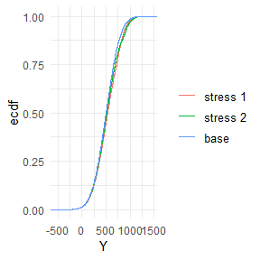
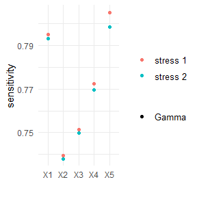

<!-- README.md is generated from README.Rmd. Please edit that file -->

# SWIM - A Package for Sensitivity Analysis

[](https://travis-ci.org/spesenti/SWIM)
[](https://cran.r-project.org/package=SWIM)
[](https://cran.r-project.org/package=SWIM)

The SWIM package provides weights on simulated scenarios from a
stochastic model, such that stressed model components (random variables)
fulfil given probabilistic constraints (e.g. specified values for risk
measures), under the new scenario weights. Scenario weights are selected
by constrained minimisation of the relative entropy to the baseline
model. The SWIM package is based on the paper Pesenti S.M, Millossovich
P., Tsanakas A. (2019) [“Reverse Sensitivity Testing: What does it take
to break the model”](https://openaccess.city.ac.uk/id/eprint/18896/).

## Vignette

The Vignette of the SWIM package is available in html format
(<https://utstat.toronto.edu/pesenti/SWIMVignette/>) and as
pdf(<https://openaccess.city.ac.uk/id/eprint/23473/>).

## Installation

The SWIM package can be installed from
[CRAN](https://CRAN.R-project.org/package=SWIM) :

> <https://CRAN.R-project.org/package=SWIM>;

alternatively from [GitHub](https://github.com/spesenti/SWIM):

> <https://github.com/spesenti/SWIM>

## Scope of the SWIM package

The SWIM package provides sensitivity analysis tools for stressing model
components (random variables). Implemented stresses are:

| R functions        | Stress                                |
| ------------------ | ------------------------------------- |
| `stress()`         | A wrapper for the `stress_` functions |
| `stress_VaR()`     | VaR risk measure, a quantile          |
| `stress_VaR()`     | VaR risk measure, a quantile          |
| `stress_VaR_ES()`  | VaR and ES risk measures              |
| `stress_mean()`    | means                                 |
| `stress_mean_sd()` | means and standard deviations         |
| `stress_moment()`  | moments, functions of moments         |
| `stress_prob()`    | probabilities of intervals            |
| `stress_user()`    | user defined scenario weights         |

Implemented functions allow to graphically display the change in the
probability distributions under different stresses and the baseline
model as well as calculating sensitivity measures.

## Example - Stressing the VaR of a portfolio

Consider a portfolio Y = X1 + X2 + X3 + X4 + X5, where (X1, X2, X3, X4,
X5) are correlated normally distributed with equal mean and different
standard deviations. We stress the VaR (quantile) of the portfolio loss
Y at levels 0.75 and 0.9 with an increase of 10%.

``` r
 # simulating the portfolio 
set.seed(0)
SD <- c(70, 45, 50, 60, 75)
Corr <- matrix(rep(0.5, 5^2), nrow = 5) + diag(rep(1 - 0.5, 5))
x <- mvtnorm::rmvnorm(10^5, 
   mean =  rep(100, 5), 
   sigma = (SD %*% t(SD)) * Corr)
data <- data.frame(rowSums(x), x)
names(data) <- c("Y", "X1", "X2", "X3", "X4", "X5")
 # stressing the portfolio 
rev.stress <- stress(type = "VaR", x = data, 
   alpha = c(0.75, 0.9), q_ratio = 1.1, k = 1)
#> Stressed VaR specified was 722.9387 , stressed VaR achieved is 722.9378
#> Stressed VaR specified was 878.859 , stressed VaR achieved is 878.8296
```

Summary statistics of the baseline and the stressed model can be
obtained via the `summary()` method.

    #> $base
    #> 
    #> 
    #>                     Y       X1       X2       X3       X4       X5
    #> ------------  -------  -------  -------  -------  -------  -------
    #> mean           500.18   100.14   100.01    99.93    99.98   100.13
    #> sd             232.13    69.79    44.93    49.83    59.85    74.76
    #> skewness         0.00    -0.01     0.00     0.01    -0.01     0.01
    #> ex kurtosis     -0.04    -0.03    -0.02    -0.01    -0.02     0.00
    #> 1st Qu.        342.56    53.24    69.70    66.23    59.45    49.72
    #> Median         500.45   100.16   100.06   100.11   100.23    99.94
    #> 3rd Qu.        657.22   147.33   130.31   133.51   140.33   150.80
    #> 
    #> $`stress 1`
    #> 
    #> 
    #>                     Y       X1       X2       X3       X4       X5
    #> ------------  -------  -------  -------  -------  -------  -------
    #> mean           534.03   108.20   104.85   105.38   106.70   108.89
    #> sd             245.47    72.32    46.35    51.48    61.90    77.60
    #> skewness        -0.06    -0.04    -0.03    -0.02    -0.04    -0.02
    #> ex kurtosis     -0.29    -0.13    -0.10    -0.10    -0.12    -0.11
    #> 1st Qu.        361.73    58.81    73.38    70.21    64.41    55.97
    #> Median         532.15   108.59   105.08   105.65   107.33   109.02
    #> 3rd Qu.        722.94   158.24   136.71   140.66   149.34   162.58
    #> 
    #> $`stress 2`
    #> 
    #> 
    #>                     Y       X1       X2       X3       X4       X5
    #> ------------  -------  -------  -------  -------  -------  -------
    #> mean           524.20   105.87   103.44   103.82   104.75   106.33
    #> sd             249.62    73.14    46.81    52.01    62.57    78.46
    #> skewness         0.09     0.04     0.04     0.05     0.04     0.06
    #> ex kurtosis     -0.19    -0.09    -0.06    -0.06    -0.08    -0.07
    #> 1st Qu.        352.14    55.99    71.60    68.34    62.00    52.93
    #> Median         516.03   104.72   102.95   103.26   104.12   104.94
    #> 3rd Qu.        687.58   155.33   134.95   138.82   146.79   159.24

Visual display of the change of empirical distribution functions of the
portfolio loss Y from the baseline to the two stressed models.

``` r
plot_cdf(object = rev.stress, xCol = 1, base = TRUE)
#> Registered S3 method overwritten by 'spatstat':
#>   method     from
#>   print.boxx cli
```



### Sensitivity and importance rank of portfolio components

Sensitivity measures allow to assess the importance of the input
components. Implemented sensitivity measures are the Kolmogorov
distance, the Wasserstein distance and *Gamma*. *Gamma*, the *Reverse
Sensitivity Measure*, defined for model component Xi, i = 1, …, 5, and
scenario weights w by

*Gamma* = ( E(Xi \* w) - E(Xi) ) / c,

where c is a normalisation constant such that |*Gamma*| \<= 1, see
<https://doi.org/10.1016/j.ejor.2018.10.003>. Loosely speaking, the
Reverse Sensitivity Measure is the normalised difference between the
first moment of the stressed and the baseline distributions of Xi.

``` r
knitr::kable(sensitivity(rev.stress, type = "all"), digits = 2)
```

| stress   | type        |     Y |   X1 |   X2 |   X3 |   X4 |   X5 |
| :------- | :---------- | ----: | ---: | ---: | ---: | ---: | ---: |
| stress 1 | Gamma       |  1.00 | 0.79 | 0.74 | 0.75 | 0.77 | 0.81 |
| stress 2 | Gamma       |  1.00 | 0.79 | 0.74 | 0.75 | 0.77 | 0.80 |
| stress 1 | Kolmogorov  |  0.08 | 0.05 | 0.05 | 0.05 | 0.05 | 0.05 |
| stress 2 | Kolmogorov  |  0.05 | 0.03 | 0.03 | 0.03 | 0.03 | 0.03 |
| stress 1 | Wasserstein | 33.84 | 8.07 | 4.84 | 5.45 | 6.72 | 8.77 |
| stress 2 | Wasserstein | 24.02 | 5.73 | 3.43 | 3.88 | 4.77 | 6.21 |

``` r
plot_sensitivity(rev.stress, xCol = 2:6, type = "Gamma") 
```



Sensitivity to all sub-portfolios, (Xi + Xj), i,j = 1, …, 6:

``` r
 # sub-portfolios
f <- rep(list(function(x)x[1] + x[2]), 10)
k <- list(c(2, 3), c(2, 4), c(2, 5), c(2, 6), c(3, 4), c(3, 5), c(3, 6), c(4, 5), c(4, 6), c(5, 6))
importance_rank(rev.stress, xCol = NULL, wCol = 1, type = "Gamma", f = f, k = k)
#>     stress  type f1 f2 f3 f4 f5 f6 f7 f8 f9 f10
#> 1 stress 1 Gamma  7  6  3  1 10  9  5  8  4   2
```

Ranking the input components according to the chosen sensitivity
measure, in this example using *Gamma*.

``` r
importance_rank(rev.stress, xCol = 2:6, type = "Gamma")
#>     stress  type X1 X2 X3 X4 X5
#> 1 stress 1 Gamma  2  5  4  3  1
#> 2 stress 2 Gamma  2  5  4  3  1
```

Visual display of the change of empirical distribution functions and
density from the baseline to the two stressed models of X5, the
portfolio component with the largest sensitivity. Stressing the
portfolio loss Y, results in a distribution function of X5 that has a
heavier tail.

``` r
plot_cdf(object = rev.stress, xCol = 5, base = TRUE)
```


``` r
plot_hist(object = rev.stress, xCol = 5, base = TRUE)
```


